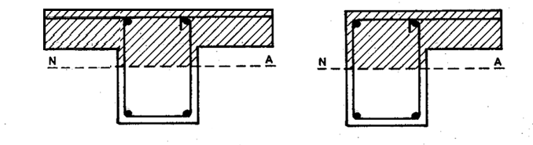
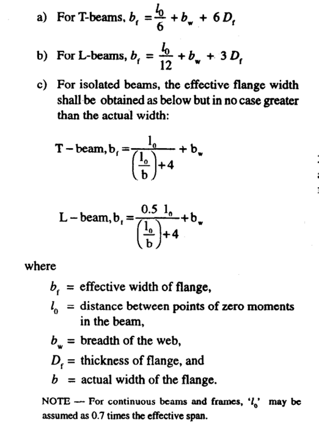

## Introduction:

In scenarios where a reinforced concrete slab sits atop a reinforced concrete beam, there's an opportunity to design and construct them to function together synergistically. By strategically distributing forces, the concrete slab can bear compression, while the steel in the beam handles tension. These cohesive units, known as flanged beams, come in various configurations such as T or L beams, depending on whether the slab is present on one or both sides of the beam.

## Effective with of flange

Regarding the effective width of the flange, in the absence of more precise calculations, it may be approximated as follows, However, the effective width of the flange should not exceed the breadth of the web plus half the sum of the clear distances to the adjacent beams on either side.

## Basis of design and analysis 

The foundational principles applied in the design of rectangular beams can also be extended to T beams. These principles, such as the assumption of maintaining plane sections after bending and the concrete strain reaching a specific threshold for failure, remain valid for T beams as well. However, the primary challenge often encountered with T beams lies in determining the necessary reinforcement to withstand a given moment. Typically, the full capacity of the T beam's concrete section isn't fully utilized during failure, leading to varying positions of the neutral axis relative to the top slab depending on the required moment resistance.

### Three different cases arise from the different positions of neutral axis. 

In Case 1, where the neutral axis resides within the flange, the T beam can be analyzed as a typical rectangular beam with a width equal to the flange width and a depth equal to the total depth of the beam.
In Case 2, when the neutral axis is positioned below the flange, and the flange thickness is sufficiently small, the stress within the concrete across the entire slab becomes uniform, reaching the maximum stress value of 0.45fck. This occurs when the minimum strain at the bottom of the slab reaches 0.002, while the extreme compression fiber attains a strain of 0.0035.( Df/d =0.2)
In Case 3, the neutral axis lies beneath the flange, yet the strain at the bottom of the slab remains below 0.002. This situation arises when the ratio of the effective depth to the total depth (Df/d) exceeds 0.2, resulting in non-linear stress distribution within the flange.

