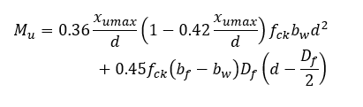
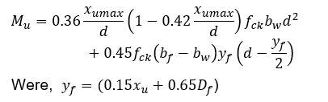

## Theory 

#### Introduction:

In scenarios where a reinforced concrete slab sits atop a reinforced concrete beam, there's an opportunity to design and construct them to function together synergistically. By strategically distributing forces, the concrete slab can bear compression, while the steel in the beam handles tension. These cohesive units, known as flanged beams, come in various configurations such as T or L beams, depending on whether the slab is present on one or both sides of the beam.

#### Effective width of flange

Regarding the effective width of the flange, in the absence of more precise calculations, it may be approximated as follows, However, the effective width of the flange should not exceed the breadth of the web plus half the sum of the clear distances to the adjacent beams on either side.

#### Basis of design and analysis 

The foundational principles applied in the design of rectangular beams can also be extended to T beams. These principles, such as the assumption of maintaining plane sections after bending and the concrete strain reaching a specific threshold for failure, remain valid for T beams as well. However, the primary challenge often encountered with T beams lies in determining the necessary reinforcement to withstand a given moment. Typically, the full capacity of the T beam's concrete section isn't fully utilized during failure, leading to varying positions of the neutral axis relative to the top slab depending on the required moment resistance. The neutral axis determines the stress block and reinforcement area. Position of neutral axis is critical in flanged beams and leads to three distinct design cases.

Case 1: Neutral axis lies within the flange
In this case, T beam can be analysed as a typical rectangular beam with a width equal to flange (bf) and depth equal to total effective depth (d). The entire compression block lies within the flange.
Case 2: Neutral axis lies in the web but Df ≤ 0.2d
In this case, neutral axis lies below flange, in the web. The strain at bottom of the flange is ≥ 0.002, so the entire flange is assumed to be under uniform stress of 0.45fck. The moment of resistance is taken as the sum of moment of resistance of web and contribution from flanges. The limiting value of the moment of resistance of the section may be obtained by the following equation:

Case 3: Neutral axis lies in the web but Df > 0.2d
In this case, the flange does not reach full stress capacity. The strain at the bottom of the slab is less than 0.002, resulting inx nonlinear stress distribution. The moment of resistance of the T-beam is taken as the sum of the moment of resistance of the web and the partial contribution of the flange, considering its non-uniform stress distribution due to 
insufficient strain. The moment of resistance of the section may be calculated as:

#### Inverted T beam

An inverted T beam is a type of flanged reinforced beam where the web is on top and the flange (usually the slab) is at bottom. The design principles remain same where the flange thickness is the same as slab thickness. These beams are commonly used in precast structures.

